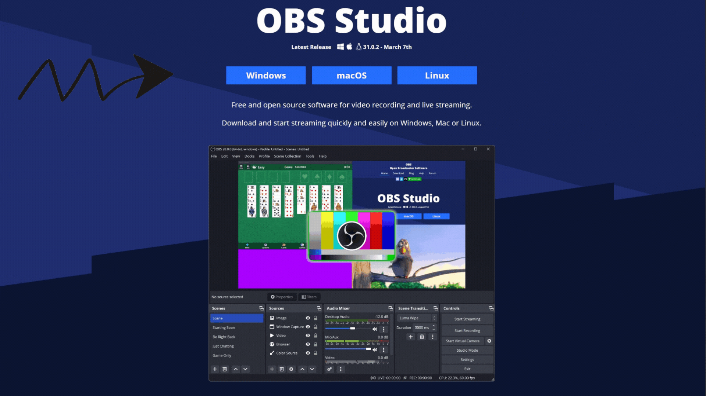

# 01 – Installing OBS Studio

Before you can stream or record anything, you need to install **OBS Studio** — the free and open-source software trusted by streamers and content creators around the world.

This guide will walk you through the installation process step by step.

---

## 🖥️ What is OBS Studio?

OBS Studio (Open Broadcaster Software) lets you:
- Stream live to platforms like Juicy, Twitch, YouTube, etc.
- Record videos locally for editing or offline publishing
- Customize your stream layout with scenes, overlays, and effects

And best of all — it’s free!

---

## 📦 Step 1 – Download OBS

1. Head to the [official OBS website](https://obsproject.com/).
2. Select your operating system:
   - **Windows**
   - **macOS**
   - **Linux**
3. Click **Download Installer** and save the file.

> ⚠️ Important: Only download OBS from the official site to avoid security risks.

## ⚙️ Step 2 – Install OBS

### 🪟 On Windows:
1. Open the `.exe` installer.
2. Follow the steps and leave the settings as default (unless you have special needs).
3. OBS will be installed and ready to launch.

### 🍎 On macOS:
1. Open the `.dmg` file and drag OBS into your Applications folder.
2. You may need to allow OBS in your **Security & Privacy settings** (System Preferences > Security > Allow OBS).

### 🐧 On Linux:
Installation depends on your distribution.  
Refer to the [Linux install instructions](https://obsproject.com/wiki/install-instructions#linux) from OBS’s official documentation.

---

## 🚀 Step 3 – First Launch & Auto Setup

1. Open OBS Studio for the first time.
2. You’ll be prompted to run the **Auto-Configuration Wizard**:
   - Choose **“Optimize for streaming”**, or **“Optimize for recording”** based on your needs.
   - OBS will automatically detect your hardware and suggest the best settings.
3. Click **Apply Settings** when it’s done.

> You can always adjust these settings later via **Settings** in the main menu.

---

## 🔍 Step 4 – Check Your Audio & Video

Before you move on, make sure:
- Your **microphone** and **speakers/headphones** are working under **Settings** > **Audio**
- OBS shows a preview of your screen or webcam when you add a source

If everything looks good — you’re ready for the next step!

---

## ✅ What’s Next?

You’ve installed OBS — great start!  
Now it’s time to connect it to your custom streaming server on Juicy:

[→ 02 – Connecting to Juicy](./02_connecting-to-juicy.md)

---

Need help installing or running into bugs?  
Visit the [OBS Forums](https://obsproject.com/forum/) or join the Juicy Discord community.
