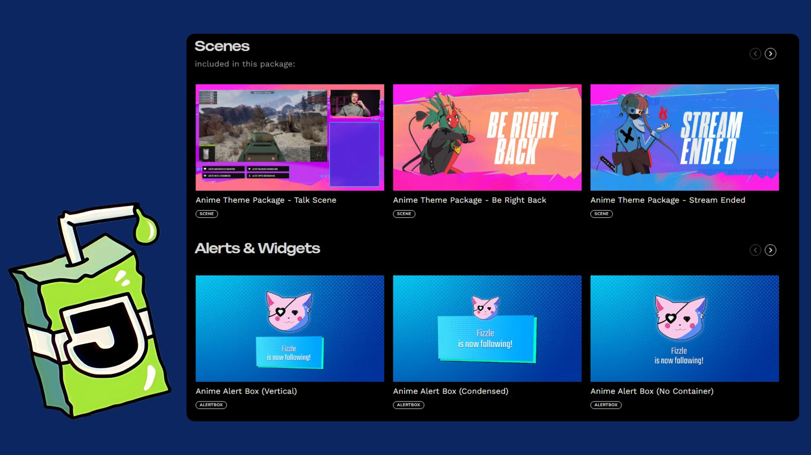
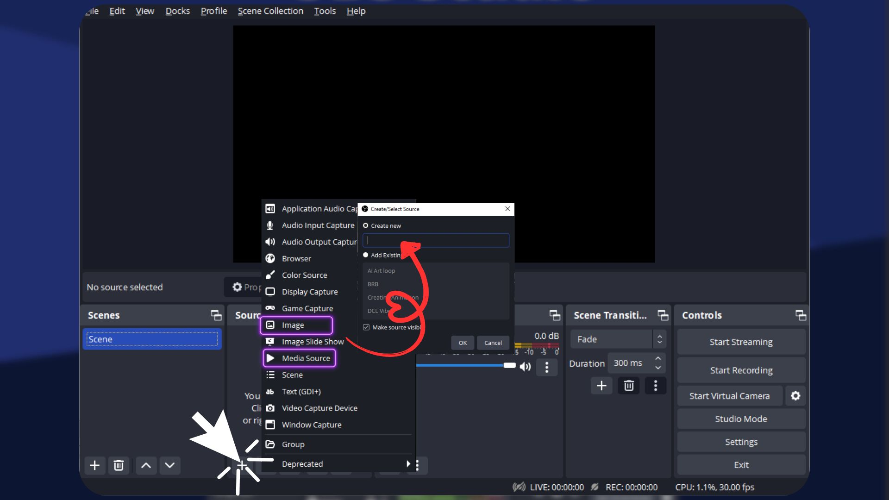

# 03 – Adding Overlays and Capturing Your Screen

In this guide, you’ll learn how to make your stream look and sound professional by:
- Adding custom overlays
- Capturing your screen, game, or browser
- Making sure your audio is working — especially desktop sound

---

## 🎯 What You’ll Learn

- How to add image and video overlays to your scenes
- How to capture your screen, game, or app window
- How to fix missing desktop audio (no game/music sound)

---

## 🧰 Step 1 – Prepare Your Overlay Files

To customize your stream, you’ll need some overlays. These can be:
- **PNG images** with transparent backgrounds (for webcam frames, labels, etc.)
- **MP4 videos** (for animated borders or transitions)

### Free Resources:
- [Behance – Free Twitch Overlays](https://www.behance.net/search/projects/free%20twitch%20overlay)
- [Canva – Stream Templates](https://www.canva.com/twitch/templates/twitch-overlay/)
- [Streamlabs Overlay Library](https://streamlabs.com/library/)
- [Hexeum – Free Stream Designs](https://hexeum.net/designs/free-stream-overlays/)

---

## 🖼️ Step 2 – Add an Image or Video Overlay

### To add an image overlay:
1. Go to the **Sources** panel > click the **+**
2. Choose **Image**
3. Name it (e.g., `Webcam Frame`) and click **OK**
4. Click **Browse**, select your PNG file, then click **OK**
5. Resize and position it in the preview window

### To add a video overlay:
1. Click **+** > **Media Source**
2. Name it (e.g., `Animated Border`) > click **OK**
3. Select your MP4 file > enable **Loop** if needed
4. Resize and place it as you like

---

## 🖥️ Step 3 – Capture Your Content (Screen, Game, or App)

### To capture your full screen:
1. Click **+** > **Display Capture**
2. Choose your display and click **OK**

### To capture a game:
1. Click **+** > **Game Capture**
2. Set Mode to **Capture specific window**
3. Select your game window

> 🧩 If the game isn’t showing up, run OBS as Administrator

### To capture a browser or app window:
1. Click **+** > **Window Capture**
2. Select the app (e.g., Chrome, PowerPoint)
3. Click **OK**

---

## 🔊 Step 4 – Set Up and Fix Audio Sources

OBS captures two main types of sound:
- **Desktop Audio**: Game, music, browser, etc.
- **Mic/Aux**: Your microphone

### If desktop audio isn’t being captured:
1. Go to **Settings** > **Audio**
2. Under **Desktop Audio**, make sure the right output is selected:
   - Try `Default`, or explicitly choose `Speakers`, `Headphones`, or `System Output`
3. Apply and click **OK**
4. Play audio from your browser or game — you should see movement in the **Audio Mixer**

### Still no sound? Try this:
- On **Windows**:
  - Right-click the speaker icon in your taskbar > **Sound settings**
  - Make sure your output device is correct and OBS is allowed in volume mixer
- On **macOS**:
  - OBS can’t capture desktop audio directly — use a tool like [BlackHole](https://existential.audio/blackhole/) or [Loopback Audio](https://rogueamoeba.com/loopback/)

---

## 🧩 Step 5 – Organize Your Scene Layout

- Drag to arrange items in the **Sources** panel (top = front layer)
- Click the 🔒 to lock a source so it doesn’t move by mistake
- Use the 👁️ icon to hide or show individual sources

---

## 🛍️ Explore Overlays and Themes

You can find overlays in different styles and categories (gaming, chill, tech, retro) from:

- [Behance](https://www.behance.net/search/projects/free%20twitch%20overlay)
- [Streamlabs](https://streamlabs.com/library/)
- [Nerd or Die](https://nerdordie.com/)

Or design your own with Canva or Photoshop.

---

## ✅ Ready for the Next Step?

Now that your stream looks and sounds awesome, it’s time to go live (or hit record):  
[→ 04 – Record and Stream](./04_record-and-stream.md)

---

Still stuck? No worries — reach out on GitHub or join our Juicy Discord community for support!
